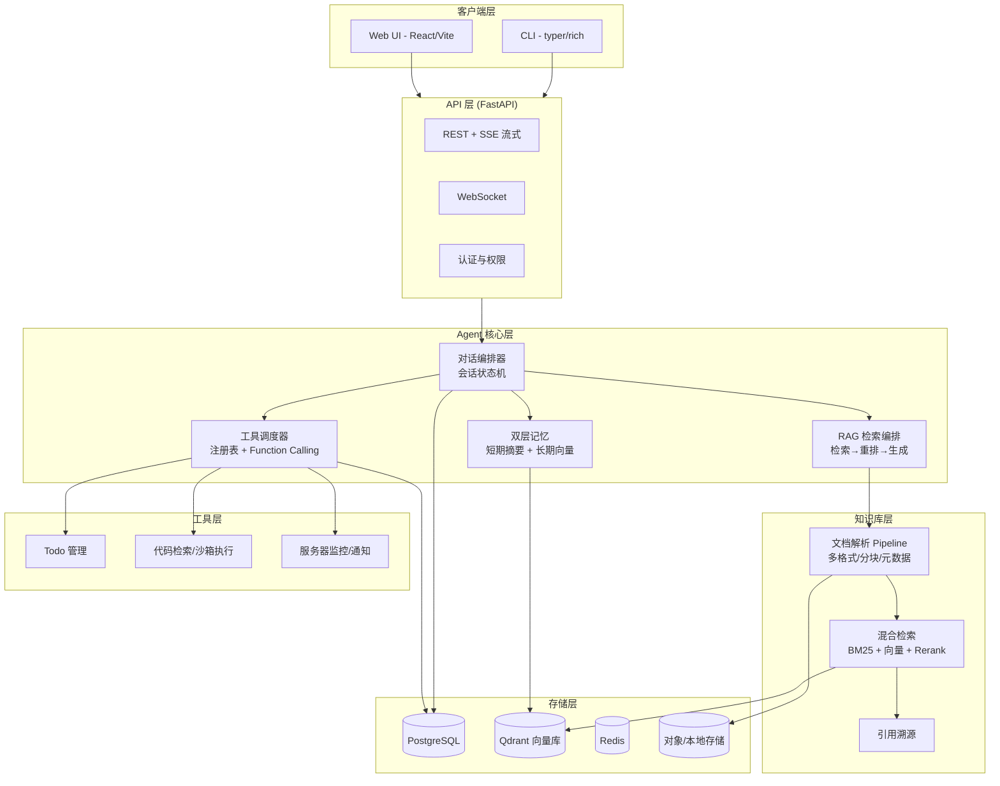

# Copilot-Lite 🧠

> 基于大模型（DeepSeek）+ 企业级 RAG + Agent 工具调用的**个人专属 AI 智能助理**。
> 支持多轮对话与长期记忆、知识库问答、可插拔工具，CLI + Web 双入口，配置文件一键切换本地 / 云端部署。

---

## 目录

- [项目简介](#项目简介)
- [核心特性](#核心特性)
- [技术栈](#技术栈)
- [系统架构](#系统架构)
- [项目结构](#项目结构)
- [快速开始](#快速开始)
- [配置说明](#配置说明)
- [开发路线图](#开发路线图)
- [面试要点](#面试要点)
- [License](#license)

---

## 项目简介

Copilot-Lite 是一个 **个人专属的 AI 智能助理**，定位为"第二大脑"：

- **记住你**：多轮对话 + 双层记忆（短期上下文 + 长期个人事实），越用越懂你；
- **理解你的资料**：把 Markdown 笔记、PDF 书籍、公司文档、代码仓库、网页收藏变成可检索的知识库，回答带引用溯源；
- **帮你做事**：通过可插拔工具集（待办管理、代码检索、沙箱执行、服务器监控、通知）完成实际操作。

本项目为个人求职作品，核心逻辑**手写实现**（不直接依赖 LangChain），
以深入理解大模型应用工程的各个环节，并借鉴主流框架的设计模式。

> 技术全景图见 [`docs/architecture.md`](docs/architecture.md)。

---

## 核心特性

### 1. 多轮对话 + 双层记忆系统
- **短期记忆**：上下文窗口滚动管理 + 历史摘要压缩，长对话不丢失主线；
- **长期记忆**：用户事实 / 偏好 / 重要结论提取 → 向量化存储 → 对话时自动召回并注入上下文。

### 2. Agent 工具调用（Function Calling）
- **ReAct 循环 + Function Calling** 双范式；
- **可插拔工具注册表**：新增一个工具 = 写一个函数 + 一行注册；
- 内置工具集：
  - 📋 **个人管理**：待办清单（Todo）增删改查
  - 📚 **知识库增强**：检索知识库、总结文档、追问引用来源
  - 💻 **开发类**：代码仓库索引检索、沙箱内安全执行代码
  - 🖥️ **系统集成**：服务器状态监控、邮件 / 通知推送

### 3. 企业级知识库（RAG）
- **多格式解析 Pipeline**：Markdown / PDF / DOCX / 代码仓库 / 网页；
- **智能分块**：按标题层级、代码结构、语义边界分块，携带元数据；
- **混合检索**：BM25 关键词检索 + 向量语义检索 + Rerank 重排；
- **引用溯源**：每个回答附来源文档与片段位置；
- **权限控制**：文档级可见性设计，敏感数据脱敏示例。

### 4. 双入口 + 配置化部署
- **CLI**（typer + rich）：快速提问、快速管理，适合日常高频使用；
- **Web UI**（React + Vite + TS）：流式对话、知识库管理、设置面板；
- 前端与 CLI 共用同一套后端 API，客户端只是壳；
- 一个配置文件控制 **本地模式 / 云端模式 / 模型切换 / 服务器规格**。

---

## 技术栈

| 层级 | 技术 | 说明 |
|---|---|---|
| 后端框架 | Python 3.11+ / FastAPI | 异步、Pydantic 校验、OpenAPI 自动文档 |
| 对话流式 | SSE / WebSocket | 流式输出打字机效果 |
| 大模型 | DeepSeek API | 原生支持 Function Calling，成本低 |
| Agent 编排 | ReAct + Function Calling | 手写编排器 + 工具注册表 |
| 向量库 | Qdrant | 轻量级、Docker 单机部署、2C4G 可跑 |
| 关系库 | PostgreSQL | 业务数据（会话 / Todo / 文档元数据） |
| 缓存 | Redis | 会话缓存 / 限流 / 队列 |
| 混合检索 | BM25 + 向量 + Rerank | 关键词与语义互补 |
| 文档解析 | markdown-it / pypdf / python-docx / BeautifulSoup | 多格式 Pipeline |
| 前端 | React + Vite + TypeScript | 主流全栈需求 |
| CLI | typer + rich | Python 生态标准 CLI 方案 |
| 部署 | Docker Compose + Nginx | 配置文件切换本地/云端 |

---

## 系统架构

> 📐 完整架构图（系统架构图、Agent 时序图、RAG 流程图、数据模型 ER 图）见
> **[`docs/architecture.md`](docs/architecture.md)**



---

## 项目结构

> 当前为规划阶段骨架，随开发推进逐步填充。

```
copilot-lite/
├── README.md                 # 项目说明（本文件）
├── docs/
│   └── architecture.md       # 架构文档 + Mermaid 图
├── backend/                  # FastAPI 后端（规划）
│   ├── app/
│   │   ├── main.py           # 应用入口
│   │   ├── api/              # 路由层
│   │   ├── core/             # 配置、安全、依赖
│   │   ├── agent/            # 对话编排、记忆、工具调度
│   │   ├── rag/              # 解析、分块、检索
│   │   ├── tools/            # 工具实现 + 注册表
│   │   └── models/           # 数据模型
│   ├── tests/
│   ├── pyproject.toml
│   └── Dockerfile
├── cli/                      # CLI 客户端（规划）
│   └── copilot_cli/
├── web/                      # React 前端（规划）
│   ├── src/
│   ├── package.json
│   └── Dockerfile
├── deploy/                   # 部署编排（规划）
│   ├── docker-compose.yml
│   ├── .env.example
│   └── nginx.conf
└── .gitignore
```

---

## 快速开始

> ⚠️ 待实现，随里程碑推进逐步补充。规划中的命令：

```bash
# 0. 准备
git clone <repo-url> && cd copilot-lite
cp deploy/.env.example deploy/.env   # 填入 DEEPSEEK_API_KEY

# 1. 启动基础设施（PostgreSQL / Qdrant / Redis）
docker compose -f deploy/docker-compose.yml up -d

# 2. 启动后端
cd backend
poetry install && poetry run uvicorn app.main:app --reload

# 3. CLI 直接聊天
pip install -e ../cli
copilot "帮我总结一下我最近的工作笔记"

# 4. Web UI（开发模式）
cd web && npm install && npm run dev
```

---

## 配置说明

> 统一通过 `deploy/.env` + YAML 配置文件控制运行模式。

| 配置项 | 说明 | 本地默认 | 云端建议 |
|---|---|---|---|
| `RUN_MODE` | `local` / `cloud` | `local` | `cloud` |
| `DEEPSEEK_API_KEY` | 大模型 API Key | 必填 | 必填 |
| `DEEPSEEK_BASE_URL` | 模型网关地址（支持切换） | 官方 | 官方/代理 |
| `DB_URL` | PostgreSQL 连接串 | `localhost:5432` | 内网/托管 |
| `QDRANT_URL` | 向量库地址 | `localhost:6333` | 同机 Docker |
| `REDIS_URL` | 缓存地址 | `localhost:6379` | 同机 Docker |
| `INGEST_ROOT` | 知识库数据根目录 | `~/copilot-data` | 挂载卷 |
| `SERVER_SPEC` | 服务器规格描述（影响并发池大小） | 自动探测 | 手动填写 |

---

## 开发路线图

| 阶段 | 周次 | 目标 | 里程碑（可演示） |
|---|---|---|---|
| **P0 地基** | 1-2 | Python 异步 + FastAPI 骨架 + 数据模型 | 后端 API 跑通 `GET /health` |
| **P1 Agent 核心** | 3-5 | 对话编排 + 双层记忆 + 工具注册表 + Function Calling | **M1：CLI 聊天 + 调用 Todo 工具** |
| **P2 知识库** | 6-8 | 解析 Pipeline + Qdrant + 混合检索 + 引用溯源 | **M2：上传笔记后带引用回答** |
| **P3 双前端** | 9-10 | Web UI（流式/知识库管理）+ CLI 完善 | **M3：Web 完整可用** |
| **P4 工程化** | 11 | Docker Compose + 配置化 + 测试 + CI | **M4：一键本地启动** |
| **P5 部署+面试** | 12 | 云端部署 + README 完善 + 面试问答准备 | **M5：云上可演示** |

---

## 面试要点

本项目设计为"**深而精**"的面试作品，可深挖的技术点：

1. **为什么不直接用 LangChain？**
   → 核心编排手写以深入理解机制（对话状态、ReAct 循环、工具协议），同时借鉴其设计模式（Tool 抽象、Memory 抽象），面试可对比阐述。

2. **混合检索为什么优于纯向量检索？**
   → 关键词（专有名词/代码符号/ID）与语义互补；BM25 召回 + 向量召回 + Rerank 融合，讲清楚排序融合策略。

3. **记忆系统如何避免"遗忘"与"污染"？**
   → 短期窗口滚动摘要 + 长期记忆按相关性召回注入，隔离上下文与长期事实的写入时机。

4. **工具调用的安全边界？**
   → 代码沙箱（资源限制/网络隔离/超时）、工具白名单注册、用户确认机制。

5. **¥50/月预算如何做架构取舍？**
   → 单机 Docker Compose 部署、Qdrant 单机版、同机内存共享，体现成本意识。

---

## License

MIT
