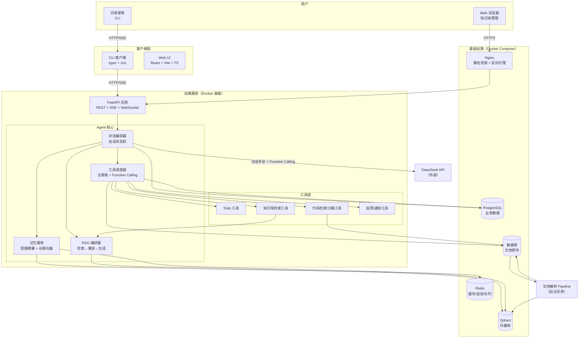
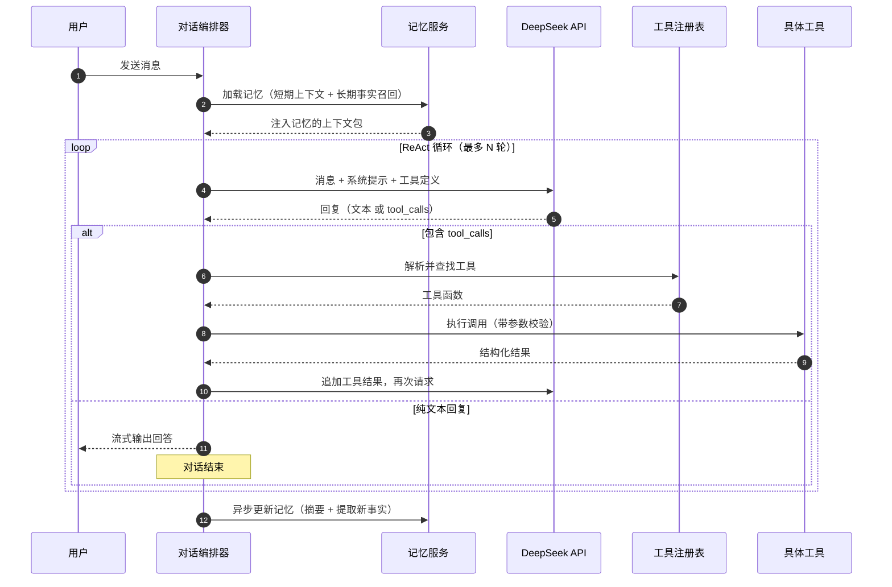
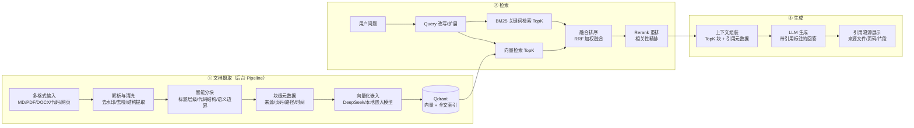
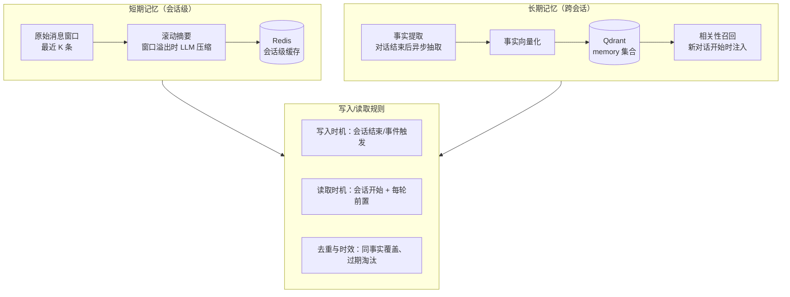
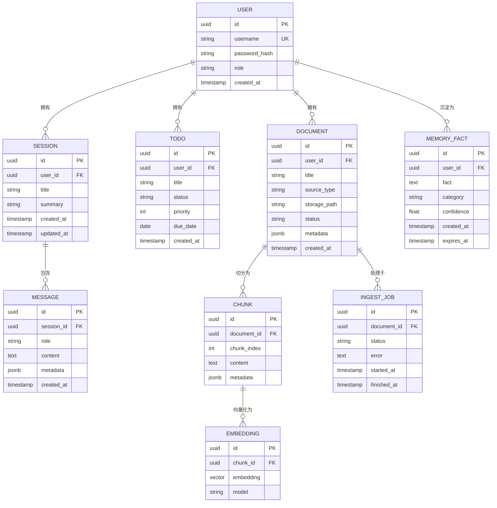
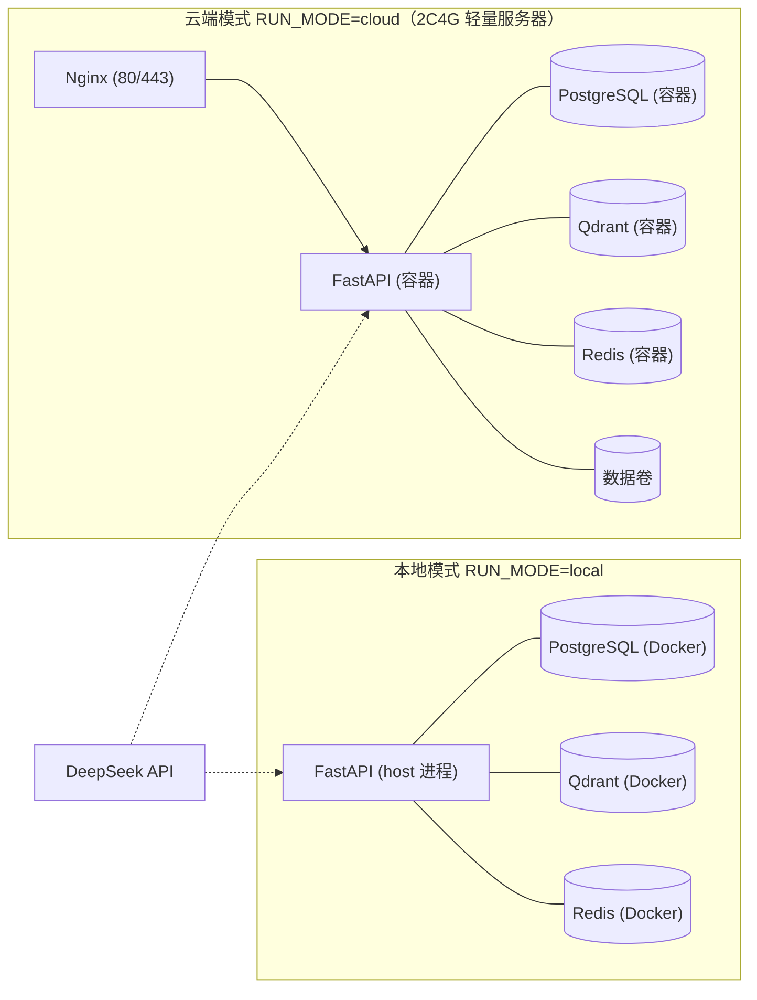

# Copilot-Lite 架构文档

> 本文档描述 Copilot-Lite 的系统架构、核心流程与数据模型，图均使用 Mermaid 绘制。

---

## 1. 系统总体架构（Container 视图）

---

## 2. Agent 对话时序（ReAct + Function Calling）

---

## 3. RAG 知识库流程（Ingest → Retrieve → Generate）

---

## 4. 双层记忆系统

---

## 5. 数据模型（ER 图）

---

## 6. 部署拓扑（本地 / 云端模式）

